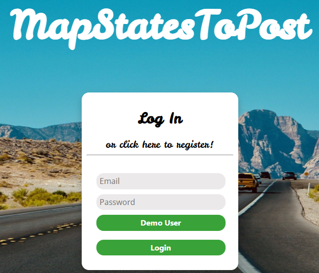

## Description

mapStatesToPost is an original web app where users can upload a post (photo and caption) from every U.S. state they have visited, and view and comment on other user's posts.  The title is an insider developer's nod to the react-redux function `mapStateToProps`.

Inspired by the fact that people like to share about all the countries they have visited, we wondered how many U.S. states people have visited.  mapStatesToPost gives users the opportunity to share a visual scrapbook of all of those destinations. 

Try it live [here!](https://mapstatestopost.herokuapp.com/#/)

(click `Demo User` for quick access)



## Technologies, Libraries, APIs

- MongoDB for the database
- Mongoose for models and validations
- Express.js for HTTP routes / backend API
- React/Redux for creating interactive UI and managing state
- Node.js as a runtime environment to use JavaScript in-app
- JavaScript/Axios for frontend code
- CSS to style components rendered on the browser
- React-icons library for icons
- SVG for map rendering
- AWS Simple Storage Service (S3) for uploading and hosting photos 
- Heroku to host the live site

## Features

With mapStatesToPost users can:

- Signup / Signin to an account
- View a personalized map where each state they have visited and uploaded a post/photo for is highlighted
- Click on any state to view fun facts about that state and see all other user's posts associated with that state
- View a personalized user's page with all of their posts for all states they have visited
- Create, read, edit, and delete a post with photo upload for a state they have visited (CRUD)
- Create, read, edit, and delete comments on other user's posts (CRUD)

## Coding Challenges

CHALLENGE: The MAP!


SOLUTION:  SOLUTION HERE

```javascript
statesFilling = () => {
    const { posts, currentUser} = this.props;
    
    let states = [];
    posts.map(post => {

      if (post.user === currentUser.id) {
      states.push(post.stateName)
      }
    })

    const res = states.reduce((acc, state) => {
       acc[state] = {
        fill: "#c8808c"
      };
      return acc;
    }, {})
    return res
  }
```

CHALLENGE: Using AWS and the MongoDB server to upload photos
- PROBLEM: When using AWS and the MongoDB server to upload photos, we were able to successfully set up the AWS S3 hosting, but there was issues with our backend database not recognizing the photo object that we are trying to create.


SOLUTION: We learned that in order to sent the file to the server to be saved, we had to instantiate a new `FormData` object. We then use the `append` method to add key/values to send to the server. One of the key/value pairs will be the binary file we grab from `this.state.file`, and the uploaded photo exist at the `files[0]` of the `<input>`tag. We also had to be mindful to have your keys match whatever your our backend controller is expecting in the params. In our case this is post['photo'].

```javascript
handleSubmit(e) {
    e.preventDefault();
    const formData = new FormData();

    formData.append('caption', this.state.caption);
    formData.append('stateName', this.state.stateName);


    if (this.state.photo){
      formData.append('photo', this.state.photo);
    }

    this.props.createPost(formData).then(this.props.closeModal());
  }

<label>Image</label>
        <input 
                className="image"
                type="file"
                onChange={e => this.setState({ photo: e.target.files[0] })}
        />
```

## Future Implementations

- Users can post details on their user profile page about upcoming trips to new states
- On the user's map the user's uploaded photo for a state is transformed into the actual shape of that state and displayed on the map
